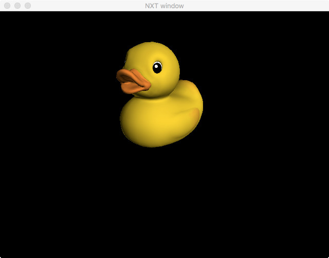

# Dawn glTF Viewer

This is a barebones glTF model viewer using the Dawn API. It is intended as a
proof of concept for the API and is not a robust model viewer. It can load
basic mesh/texture data from a few
[glTF sample models](https://github.com/KhronosGroup/glTF-Sample-Models/tree/master/1.0),
such as:

* 2CylinderEngine
* BoxWithoutIndices
* Cesium Man
* Duck
* Monster
* VC (Virtual City)

## Usage

`build/examples/glTFViewer/glTFViewer path/to/Duck.gltf`

`build/examples/glTFViewer/glTFViewer path/to/Duck.gltf --backend metal`

## Screenshots

Duck:

VC (Virtual City):

